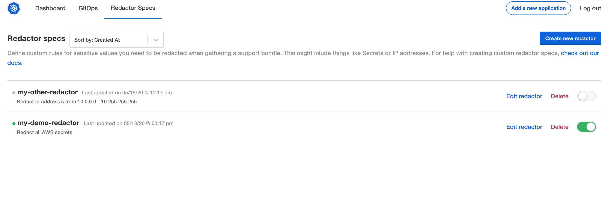

# Individual Redactors API

Add a set of APIs to allow getting/setting redactors by name, not just as a group.

## Goals

- allow listing redactors by name
- allow editing an individual redactor
- allow creating/removing an individual redactor
- allow storing metadata, including enabling/disabling redactors

## Non Goals

- preservation of ordering/comments in the redaction spec

## Background

Custom redactors are being moved to a more informative UI, planned to look something like this:

API routes for individual redactors would greatly simplify implementation and move logic from frontend to backend.


## High-Level Design

Two new API routes will be added - `/api/v1/redacts` to list redactor information and GET/POST/DELETE `/api/v1/redact/spec/{slug}` to get/set/delete them by slug.
'slug' is the name, in lowercase, with ` ` changed to `-` and symbols removed.

The second set of APIs will not operate on full troubleshoot/Redactor documents - instead, it will operate on the [redact spec itself](https://github.com/replicatedhq/troubleshoot/blob/8f594e876470fa72c6fb0389e8f89fabcde9e017/pkg/apis/troubleshoot/v1beta1/redact_shared.go#L8-L16).
This will result in yaml like the following, which will then be combined when using the existing `/api/v1/redact/get` route:
```yaml
name: replace literal string
values:
- redact-me-first
files:
- literals/a-redact-file
```

`/api/v1/redact/get` will retain the previous behavior. `/api/v1/redact/set` will still add/update redact specs, but it will do so by splitting it into individual redactors and updating those by name.
If no name is provided, one will be autogenerated.

## Detailed Design

### Method Details

The `get` method of `/api/v1/redact/spec/{slug}` will return the following struct:
```go
type GetRedactorsResponse struct {
	Redactor string       `json:"redactor"`
    Metadata RedactorList `json:"redactorMetadata"`

	Success bool   `json:"success"`
	Error   string `json:"error,omitempty"`
}
```

`post` to `/api/v1/redact/spec/{slug}` should be of the following form:
```go
type PostRedactorMetadata struct {
	Name        string `json:"name"`
	Enabled     bool   `json:"enabled"`
	Description string `json:"description"`
    New         bool   `json:"new"`
    Redacto     string `json:"redactor"`
}
```

If 'name' changes in the yaml or request body, the name will be changed.
If 'name' is removed, it will be readded.

If 'new' is set to true, the destination slug is ingored in favor of the name in the request or spec.

It will return `GetRedactorsResponse`.

`delete` to `/api/v1/redact/spec/{slug}` will return 200 on success.

Getting `/api/v1/redacts` wil return this:

```go
type ListRedactorsResponse struct {
	Redactors []RedactorList `json:"redactors"`

	Success bool   `json:"success"`
	Error   string `json:"error,omitempty"`
}

type RedactorList struct {
	Name        string    `json:"name"`
	Slug        string    `json:"slug"`
	Created     time.Time `json:"createdAt"`
	Updated     time.Time `json:"updatedAt"`
	Enabled     bool      `json:"enabled"`
	Description string    `json:"description"`
}
```

### Backend Changes

Storing metadata about individual redactors requires additional changes.
Currently, all redactors are stored as a yaml document at the `kotsadm-redact` key within the `kotsadm-redact` configmap.
Now, redactors will be stored individually at the `<name>` key within the `kotsadm-redact` configmap.
Further, instead of storing raw yaml there, an object containing metadata and the redactor will be stored.

```go
type RedactorMetadata struct {
	Metadata RedactorList `json:"metadata"`

	Redact v1beta1.Redact `json:"redact"`
}
```

## Security Considerations

There are no security considerations for this change.
